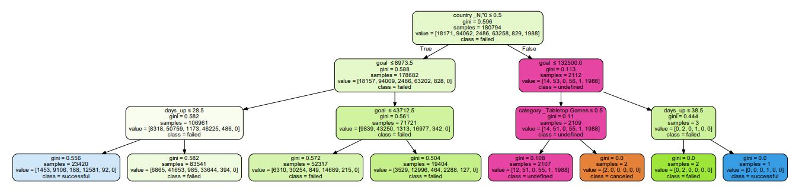
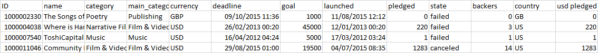

# Decision-Trees-Random-Forests

#Kickstarter Status Classifier

##Abstract
Documentation for the Decision Trees hand in for Tec Campus Querétaro Sistemas Inteligentes Ago-Dic 2019 as a Kickstarter status classifier. The code cleans the dataset (and splits it into test and training sets), generates or validates a decision tree with the set parameters, logs the accuracy, prints a pdf with the resulting tree and saves the model in a pickle file. [A Kickstarter dataset found in Kaggle](https://www.kaggle.com/kemical/kickstarter-projects) is used with the intention of being able to predict the success of a project with a reasonable accuracy. The Scikit-Learn libraries were used to model the tree, data handling was done in pandas, the pickle library was used to save and load the models. Results show that using gini criterion, a <i>max_depth</i> of 10 and basically the preset settings gave the best results for prediction (with 69% accuracy).

A decision tree is a 'support tool' for visualizing decisions and their possible consequences by presenting them in a tree-like graph model (branches stem from 'parent' nodes up until a common root). Thanks to the evolution and convergence of statistical analysis and computational sciences we can model a decision tree in order to find patterns and predict instances in an applicable way. 

These branch nodes represent a conditional 'true' or 'false' selection of a certain dataset parameter which then creates a corresponding branch to the next conditional node in order to . This means that the nodes of a predictive decision tree

create a decision tree model that can be trained with a certain dataset in order to make cualitative (classification) and cuantitative (regression) predictions

In data science and machine learning, decision trees are a supervised non-parametric learning method used for classification and regression. 

Crowdfunding is the practice of funding a project by raising 'small' amounts of money from a large number of people. Kickstarter is an online crowdfunding platform where projects get funded by the community in exchange of rewards. 

I found a rather big dataset of the platform when browsing Kaggle. The raw .csv data looks like this:

The dataset has more than 300,000 samples, which could potentially give us a rather accurate model. On a first look, we see the website ID, name of the project, category, the date it was launched and the deadline, how much money was pledged, the state of the project, the backers and the country. The feature I'm most interested on is the <b>State</b>, so we will have to set this as our output <i>'Y'</i>. The rest of our columns, <i>'X'</i>, will be used to train the model. The project's state can fall in one of these 6 categories: ['canceled', 'failed', 'live', 'successful', 'suspended', 'undefined']. I noticed after running many models however that the categories canceled, failed and suspended result in very noisy and inaccurate classifications.

Similar but more complex exercises found on the web seem to add more attributes to the data, ranging from user interaction (shares and comments by the backers) to how many Facebook friends the project creator has. This did seem to up the accuracy with which their models could predict results. Additional data that I propose as helpful could include historical funding data, the buzz the project has on social media, a linguistic analysis of the working title and perhaps an analysis of the 'pitch elements' (such as the impact of the promotional video and how the description of the project is worded). For the purpose of this delivery I'll try to get a model as good as possible with the data provided by this dataset.

Since the dates found in the dataset have some weird formatting, I used the already built Excel tools to substract the initial date from the deadline, getting as a result a 'days_up' column.

I used the pandas library to get experience managing dataframes in the Python environment (instead of manually editing the Excel file). This let me change the code parameters and tune the data to experiment with different models and datasets quickly. Many cells were missing and the dataset had some unusable, erroneous data (ej. numbers in the category and main_category columns, which are only expected to have strings). The split_csv() and prepare_dataset() functions I defined clean up the data by removing empty cells or invalid terms as well as dropping columns as needed.

After loading the .CSV file

Since we are going to validate our model after training it (more on this later), it's best if we shuffle all of our rows (so we can make sure our database isn't biased) and split our entire dataset in two parts, allowing us to use 90% of the data for a training set and 10% for a test set.

`

In order to translate categorical into numerical data I used One Hot Encoding with the function 'get_dummies()' in order to have the model working properly. In the case of the output, I tried both using strings for categories as well as an equivalent number to see if it made any difference (found none).

Once I fit my first model, I realized that I would be running multiple tests in order to find the most suitable hyperparameters for my tree and , so I had to find a way to save and load my models for future use. I also implemented a logger so I could have the historical data of the models run.

It seems to be that my optimal max_depth is 10, as going under drops the accuracy and anything above that overfits the model.

After dropping the 'canceled', 'live' and 'suspended' categories, the accuracy of my model went up by 10% which is huge:

I noticed that tweaking the criterion, minimun samples per split and minimun samples per split did not help my model (the accuracy only went down). Perhaps in the future when I'm more experienced with these kind of tools I'll be able to find better parameters without dropping accuracy or overfitting the model.
